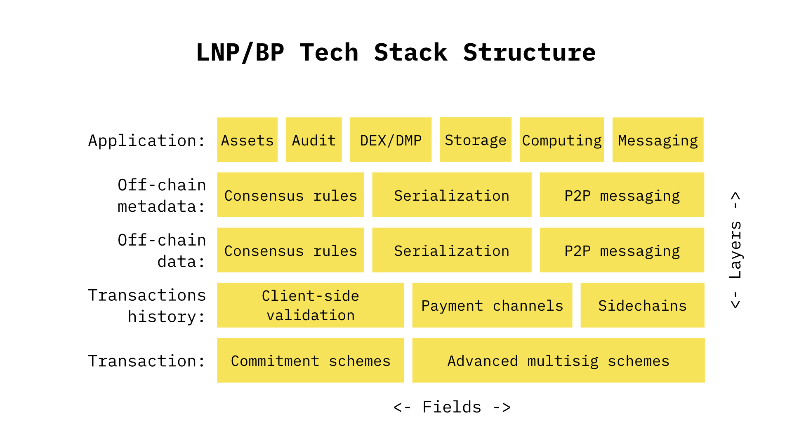

# LNP/BP Specifications

LNP/BP stands for "Bitcoin Protocol / Lightning Network Protocol". This set of specifications covers standards & best 
practices for Layer 2, 3 solutions (and above) in cases when they do not require soft- or hard-forks on the Bitcoin 
blockchain level and are not directly related to issues covered in Lightning Network RFCs (BOLTs).

Basically, LNP/BPs cover everything that can be anchored to Bitcoin transactions, defines primitives for L2+ solution
design and describes complex use cases which can be built from some primitives. This allows such solutions as financial 
assets, storage, messaging, computing and different forms of secondary markets leveraging Bitcoin security model and 
Bitcoin as a method of payment/medium of exchange.

Criteria for a LNP/BP specification proposal:
* Should not be covered by existing or proposed BIPs
* Should not cause soft- or hard-fork in Bitcoin blockchain (but may depend on soft-forks from an existing BIP proposals)
* Should not distort Bitcoin miner's economic incentives
* Should not pollute Bitcoin blockchain with unnecessary non-transaction related data or have to maintain such pollution
  as low as possible
* Should not be covered by existing or proposed BOLTs
* Must not require a utility or security tokens to function (but may enable creation of digital assets or tokenized 
physical goods)
* Must not depend on non-bitcoin blockchains (but may be applicable to bitcoin-compatible blockchains)

## Layers and fields for LNPBPs proposals:

Number (bottom-up) | Title | Description | Fields
------------------:| ----- | ----------- | ------
1                  | Transaction | Data or protocols defined for a single bitcoin transaction (both PSBT and mined) | Cryptographic primitives, Multisignature schemes
2                  | Transaction graph | Data and protocols defined on a transaction graph | Client-side validation, Payment channels, Sidechains
3                  | Off-chain data | Protocols and formats for off-chain data (persistent or ephemeral) | Consensus rules, Serialization, P2P messaging
4                  | Off-chain metadata | Protocols and formats for off-chain data about the data (metadata) | Consensus rules, Serialization, P2P messaging
5                  | Application | Specific high-level applications build of underlying layers (storage, messaging, assets etc) | Assets, Audit, Storage, Computing, Messaging, DEX/DMP*

* DEX: decentralized exchanges, DMP: decentralized markets/marketplaces

## List of current LNP/BP proposals

Number | Layer | Field | Title | Owner | Type | Status
------:| ----- | ----- | ----- | ----- | ---- | ------
[1](lnpbps-0001.md) | Transaction (1) | Cryptographic primitives | Key tweaking: collision-resistant elliptic curve-based commitments | n/a | Standard | Draft
[2](lnpbps-0002.md) | Transaction (1) | Cryptographic primitives | Embedding elliptic curve-based commitments into transaction outputs | n/a | Standard | Draft
3      | Transaction DAG (2) | Client-side validation | Simple single-use seal for LNP/BP | n/a | Standard | Draft
4      | Offchain data (3) | Consensus rules | Stagegraphs: State history directed acyclic graphs on Bitcoin | n/a | Standard | Draft
5      | Offchain data (3) | Serialization | Serialization for Stagegraphs, LNPBPS-0004 | n/a | Standard | Draft
6      | Offchain metadata (4) | Serialization | Schemata for rich client-validated state with single-use seals | n/a | Standard | Draft
7      | Application (5) | Assets | RGB, part 1: Fungible centrally-issued assets with client-side validation | n/a | Standard | Draft
8      | Offchain data & metadata (3-4) | P2P messaging | State announcements for Lightning Network gossip protocol | n/a | Standard | Draft
9      | Offchain data & metadata (3-4) | P2P messaging | State updates over Lightning Network onion messaging | n/a | Standard | Draft
10     | Application (5) | DEX/DMP | Spectrum: decentralized market / exchange over Lightning Network | n/a | Standard | Draft
11     | Offchain metadata (4) | Assets | RGB, part 2: Zero-knowledge proofs for asset transfers | n/a | Standard | Draft
