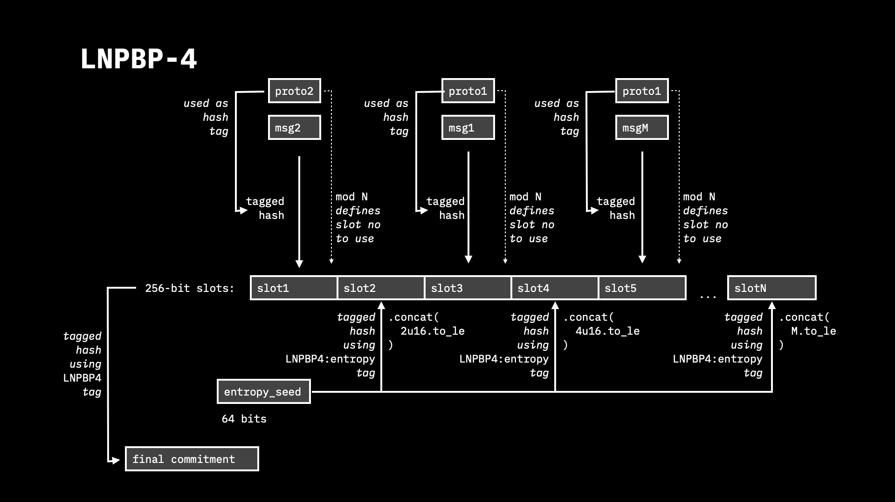

```
LNPBP: 0004
Layer: Transaction (1)
Vertical: Client-validated data (3)
Title: Multi-message commitment scheme with zero-knowledge provable unique properties
Author: Dr Maxim Orlovsky <orlovsky@protonmail.ch>
Comments-URI: https://github.com/LNP-BP/lnpbps/issues/8
Status: Proposal
Type: Standards Track
Created: 2019-10-28
Finalized: not yet
License: CC0-1.0
```

## Abstract

The standard defines a way to commit to a multiple independent messages with a
single digest such that the fact of each particular commitment, and a protocol
under which the commitment is made may be proven without exposing the
information about the other messages and used protocols.


## Background and Motivation

LNPBP-3 defines a standard for embedding cryptographic commitment into bitcoin
transaction in a deterministic & provable way [2]. The standard is based on
LNPBP-1 public key tweaking procedure [1], which prevents multiple commitments
inside a tweak. However, this may result in two potential problems.

First, there could be two different protocols willing to put different 
commitments into a single transaction output; and only one of the protocols will
succeed due to the LNPBP-2 & LNPBP-1 design.

Second, it is possible that some protocol may require committing to a number of
messages within a single transaction and public key with the requirement that
some dedicated information from these messages (like the message type) should be
unique across the whole message set. For instance, this is required for state
updates, where such updates separated into different blocks (messages) and
should be kept private, such that a single party will know information about a
single update and should not be disclosed any information about the rest.
However, in such case, there should be a proof that the other state updates do 
not affect the state of the analyzed update, excluding state collisions. In such
a setup, each state may be assigned a unique integer identifier (like
cryptographic digest), and a special form of zero-knowledge proof should be
utilized to proof the fact that all the states are different without exposing
the actual state ids. 

While both cases are impossible at the level of LNPBP-3 & LNPBP-1 standards, the
current proposal defines a procedure for structuring multiple independent
messages in a privacy-preserving (zero-knowledge) way, allowing that some
properties of the committed messages may be proven in a zero-knowledge way, i.e.
without revealing any information about the source messages or the properties 
themselves.


## Design

The protocol follows dea of Bloom filters [5], which are already used for
keeping confidentiality of the information requested from Bitcoin Core by SPV
clients [6].

Multiple commitments under different protocols are identified with a unique
per-protocol 256-bit identifiers (like tagged hashes of protocol name and/or
characteristic parameters) and serialized into 256-bit slots within `N * 32`
byte buffer such as `N >> M`, where `M` is the number of the individual
commitments. The rest of the slots is filled with random data deterministically
generated from a single entropy source. The position `n` for a commitment with
the identifier `id` is computed as `n = id mod N`, guaranteeing that no two
commitments under the same protocol with a given `id` may be simultaneously
present.

```
      Protocol-1 -+                                 Protocol-2 -+
  MSG-1   |       V                             MSG-2   |       V
    V     V     Id-1                              V     V     Id-2
[Tagged SHA256]   V                           [Tagged SHA256]   V
       |       [mod 3]                               |       [mod 3]
       |          V                                  |          V
       V          1                                  V          3
+----------------------+----------------------+----------------------+
| MSG-1 commitment     | Random hash          | MSG-2 commitment     |
+----------------------+----------------------+----------------------+
0 byte                  32 byte                64 byte
```



## Specification

### Commitment

For a given set of `M` messages `msg1`..`msgM` under protocols with 
corresponding unique ids `id`..`idM` the commitment procedure runs as follows:
1. Pick 64 bits of entropy from uniform entropy source (like the same 
   which is used for generating private keys). This entropy will be 
   identified with `entropy_seed` hereinafter.
2. Pick a 16-bit number `N >> M`, for instance `N = M * 2` and allocate `32*N`
   byte buffer (such that the maximum buffer length MUST not exceed 2^21, i.
   e 2 MB).
3. For each of the messages:
   - create a corresponding cryptographic commitment `cI` according to the 
     per-message protocol, 
   - compute it's BIP-340 tagged hash [4] using the value of the protocol id 
     `idI` as the protocol-specific tag, 
   - compute `n = idI mod N`,
   - if the slot `n` is not used, serialize a `cI` hash into it using 
     bitcoin-style hash serialization format; 
     otherwise go to step 3 and generate a new `N' >> N`.
4. For each of the slots that remain empty (the slot number is represented 
   by `j`):
   - compute SHA256-tagged hash of `seed_entropy || j`, where `j` is stored as
     little-endian two byte representation, i.e. the total length of the 
     hashed byte string should be 272 bits. The tagged hash procedure must run 
     according to BIP-340 [4] using UTF-8 representation of  `LNPBP4:entropy` 
     string as the tag.
5. Compute commitment to the resulting buffer with LNPBP-1 [1], LNPBP-2 [2] or 
   other protocol using `LNPBP4` as the protocol-specific tag.

### Partial reveal

A party needing to reveal the proofs for the commitment to the message `msgA` 
under this scheme and conceal the rest of the messages and protocols 
participating in the commitment has to publish the following data:
1. A source of the message `msgA` and information about its protocol with id 
   `idA`.
2. A full byte sequence of the buffer resulting from the step 5 of the 
   [commitment procedure](#commitment).

### Reveal with full disclosure

A party needing to reveal the proofs for all commitments to all the messages 
and prove that there were no other commitments made must publish the 
following data:
1. A source of the messages `msg1`..`msgM` and information about their 
   protocols with id `id1`..`idM`.
2. A full byte sequence of the buffer resulting from the step 5 of the 
   [commitment procedure](#commitment).
3. An entropy value `entropy_seed` from the step 2 of the 
   [commitment procedure](#commitment).

### Per-message verification

A party provided with the data from the 
[partial reveal procedure](#partial-reveal) and wishing to verify the commitment
to the message MUST use the following procedure:
1. Compute `n = idA mod N`, where `idA` is the message-specific protocol id 
   and `N` is the length of the commitment buffer in bytes divided on 32.
2. Compute commitment to the message by following the procedure from the 
   step 3 of the [commitment scheme](#commitment)
3. Verify that the resulting 32-bit commitment is equal to the commitment 
   stored in `n`'s 32-byte slot of the commitment buffer; fail verification 
   otherwise.

### Verification of the full disclosure

A party provided with the data from the 
[reveal with full disclosure procedure](#reveal-with-full-disclosure) may verify
that the provided commitment buffer contains only commitment to the provided 
messages (and no other commitments) by allocating a new empty (all bytes set 
to `0x00`) commitment buffer of the same length as the revealed commitment 
buffer, and re-running steps 4-6 from the [commitment procedure](#commitment)
. If the new buffer match per-byte the revealed commitment buffer, then the 
verification succeeded; otherwise it has failed.


## Compatibility

TBD


## Rationale

### Maximum buffer size restrictions

The maximum buffer size defines the potential size of the data provided for 
client-side-validation, and may represent a form of DoS attack vector, when 
the party allocating/creating buffer defines a storage and network data 
transfer requirements for all the future verifying parties. From the other 
side, the maximum buffer size defines the upper bound for the maximum number 
of commitments that may be embedded within a single transaction  output. We 
have selected a 16-bit limit for the number of slots, limiting the maximum 
buffer size to 2 MBs, and maximum theoretical number of simultaneous 
commitments under the same transaction output to 2^16. However, in practice, 
the latter limit will never be reached, because assuming the uniform 
distribution of protocol-specific identifier hashes a committing party will 
be able to produce simultaneous commitment under `1^8` different protocols 
in average.


## Reference implementation

Reference implementation can be found inside client-side-validation foundation
rust library <https://github.com/LNP-BP/client_side_validation/blob/master
/commit_verify/src/multi_commit.rs> and represents integral part of this 
standard.


## Acknowledgements

## References

1. Maxim Orlovsky, et al. Key tweaking: collision-resistant elliptic 
   curve-based commitments (LNPBP-1 Standard).
   <https://github.com/LNP-BP/lnpbps/blob/master/lnpbp-0001.md>
2. Maxim Orlovsky, et al. Deterministic embedding of LNPBP1-type commitments 
   into `scriptPubkey` of a transaction output (LNPBP-2 Standard). 
   <https://github.com/LNP-BP/lnpbps/blob/master/lnpbp-0002.md>
3. Giacomo Zucco, et al. Deterministic definition of transaction output 
   containing cryptographic commitment (LNPBP-3 Standard).
   <https://github.com/LNP-BP/lnpbps/blob/master/lnpbp-0003.md>
4. Pieter Wuille, et al. BIP-340: Schnorr Signatures for secp256k1.
   <https://github.com/bitcoin/bips/blob/master/bip-0340.mediawiki>
5. Bloom, Burton H. (1970), "Space/Time Trade-offs in Hash Coding with 
   Allowable Errors", Communications of the ACM, 13 (7): 422–426, doi:10.
   1145/362686.362692.
   <https://citeseerx.ist.psu.edu/viewdoc/summary?doi=10.1.1.641.9096>
6. Mike Hearn, Matt Corallo. BIP-37: Connection Bloom filtering.
   <https://github.com/bitcoin/bips/blob/master/bip-0037.mediawiki>


## Copyright

This document is licensed under the Creative Commons CC0 1.0 Universal license.


## Test vectors

TBD
